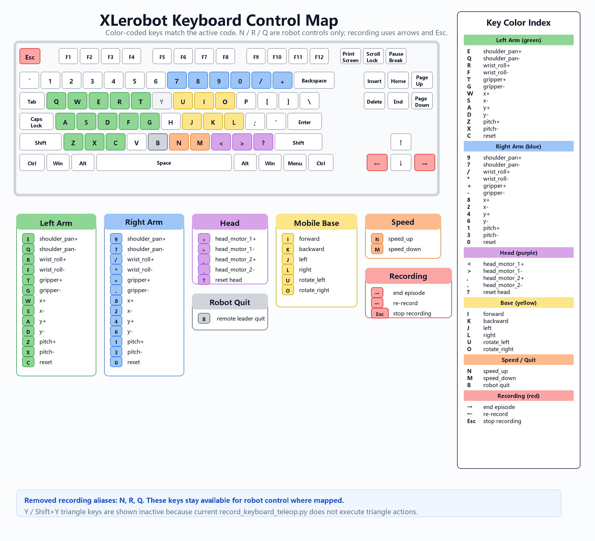

# XLerobot Keyboard Controls

This page documents the active keyboard controls after removing the recording aliases for `N`, `R`, and `Q`.
Those keys are kept for robot control only. Recording flow now uses only arrow keys and `Esc`.

## `record_keyboard_teleop.py`

### Left Arm

| Key | Action |
| --- | --- |
| `Q` / `E` | Shoulder pan `-` / `+` |
| `W` / `S` | End-effector X `+` / `-` |
| `A` / `D` | End-effector Y `+` / `-` |
| `Z` / `X` | Pitch `+` / `-` |
| `R` / `F` | Wrist roll `+` / `-` |
| `T` / `G` | Gripper `+` / `-` |
| `C` | Reset left arm |

### Right Arm

| Key | Action |
| --- | --- |
| `7` / `9` | Shoulder pan `-` / `+` |
| `8` / `2` | End-effector X `+` / `-` |
| `4` / `6` | End-effector Y `+` / `-` |
| `1` / `3` | Pitch `+` / `-` |
| `*` / `/` | Wrist roll `-` / `+` |
| `+` / `-` | Gripper `+` / `-` |
| `0` | Reset right arm |

### Head Pan-Tilt

| Key | Action |
| --- | --- |
| `<` / `>` | Head motor 1 `+` / `-` |
| `,` / `.` | Head motor 2 `+` / `-` |
| `?` | Reset head |

`<`, `>`, and `?` normally require `Shift` on an English keyboard.

### Mobile Base

| Key | Action |
| --- | --- |
| `I` / `K` | Forward / backward |
| `J` / `L` | Move left / move right |
| `U` / `O` | Rotate left / rotate right |

### Speed

| Key | Action |
| --- | --- |
| `N` | Increase speed |
| `M` | Decrease speed |

### Recording Flow

| Key | Action |
| --- | --- |
| `Right Arrow` | Finish current episode early |
| `Left Arrow` | Re-record current episode |
| `Esc` | Stop the full recording task |

Removed recording aliases: `N`, `R`, and `Q`.

## `record_remote_bi_so101_leader_keyboard.py`

### Dual Arms

| Input | Action |
| --- | --- |
| Left SO-101 leader arm | Teleoperate the left follower arm joints |
| Right SO-101 leader arm | Teleoperate the right follower arm joints |

This script does not use keyboard keys for dual-arm control.

### Head Pan-Tilt

| Key | Action |
| --- | --- |
| `<` / `>` | Head motor 1 `+5 deg` / `-5 deg` |
| `,` / `.` | Head motor 2 `+5 deg` / `-5 deg` |

`<` and `>` normally require `Shift` on an English keyboard. This script has no head reset key.

### Mobile Base

| Key | Action |
| --- | --- |
| `I` / `K` | Forward / backward |
| `J` / `L` | Move left / move right |
| `U` / `O` | Rotate left / rotate right |

### Speed And Quit

| Key | Action |
| --- | --- |
| `N` | Increase speed |
| `M` | Decrease speed |
| `B` | Send robot quit signal and stop recording |

### Recording Flow

| Key | Action |
| --- | --- |
| `Right Arrow` | Finish current episode early |
| `Left Arrow` | Re-record current episode |
| `Esc` | Stop the full recording task |

Removed recording aliases: `N`, `R`, and `Q`.
